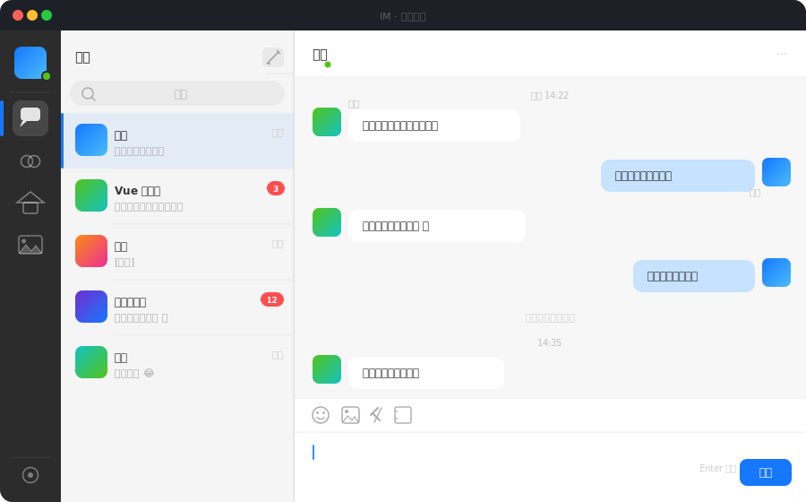

<div align="center">

# 💬 IM

**仿 QQ NT 风格的 Web 即时通讯系统**

[](https://vuejs.org/)
[](https://www.typescriptlang.org/)
[](https://go.dev/)
[](https://sqlite.org/)
[](LICENSE)

[**查看展示页 →**](https://lfrankl.github.io/IM/)&nbsp;&nbsp;·&nbsp;&nbsp;[源码](https://github.com/LFrankl/IM)

</div>

---

## 界面预览



---

## 功能特性

| 模块 | 功能 |
|------|------|
| 🔐 **认证** | 注册、登录、JWT 鉴权，自动续期 |
| 👤 **好友系统** | 搜索用户、发送/接受好友申请、备注、删除 |
| 💬 **私聊** | WebSocket 实时消息、图片/文件传输、消息撤回、历史分页 |
| 👥 **群聊** | 创建/搜索/加入群组、成员管理、群主踢人与权限控制 |
| 🏠 **个人空间** | 发布动态（文字+图片）、点赞、评论、好友 Feed 流 |
| 😊 **Emoji** | 200+ Emoji 分类选择，光标位置精准插入 |
| 🔔 **实时推送** | 好友上下线、未读角标、消息撤回通知全量实时 |

---

## 技术栈

```
前端                          后端
─────────────────────         ─────────────────────
Vue 3  ·  TypeScript          Go 1.21+
Pinia  ·  Vue Router          Gin  ·  GORM v2
Vite 5                        gorilla/websocket
                              SQLite  ·  JWT
```

架构分层：`Views / Components → Pinia Store → HTTP & WebSocket → Handler → Service → DAO → SQLite`

---

## 快速启动

```bash
# 后端（监听 :8080）
cd backend && go run main.go

# 前端（监听 :5173）
cd frontend && npm install && npm run dev
```

> Vite 已配置代理，`/api` 和 `/ws` 自动转发到 `:8080`，无需额外跨域配置。

---

## 项目结构

```
im/
├── backend/
│   ├── main.go
│   ├── config/config.yaml
│   └── internal/
│       ├── model/       # GORM 数据模型
│       ├── dao/         # 数据访问层
│       ├── service/     # 业务逻辑
│       ├── handler/     # HTTP / WS 处理器
│       ├── middleware/  # JWT 鉴权
│       ├── router/      # 路由注册
│       └── ws/          # WebSocket Hub
└── frontend/src/
    ├── api/             # Axios 请求层
    ├── stores/          # Pinia 状态
    ├── views/           # 页面组件
    ├── components/      # 通用组件
    └── composables/     # useWebSocket 等
```

---

## WebSocket 协议

连接：`ws://localhost:8080/ws?token=<jwt>`

```json5
// 客户端发送
{ "type": "chat_private", "to_id": 123, "content": "hello", "msg_type": "text" }
{ "type": "chat_group",   "group_id": 456, "content": "hello", "msg_type": "text" }

// 服务端推送
{ "type": "message",          "data": { ... } }
{ "type": "friend_request",   "data": { ... } }
{ "type": "friend_online",    "data": { ... } }
{ "type": "message_recalled", "data": { "msg_id": 123, "chat_type": "private" } }
```

---

## 配置

`backend/config/config.yaml`

```yaml
server:
  port: 8080
database:
  path: ./data/im.db
jwt:
  secret: "your-secret"
  expire: 168h
cors:
  allow_origins:
    - "http://localhost:5173"
```

| 资源 | 路径 |
|------|------|
| 数据库 | `backend/data/im.db` |
| 上传文件 | `backend/data/uploads/` |

---

<div align="center">

Built with Vue 3 + Go &nbsp;·&nbsp; MIT License

</div>
